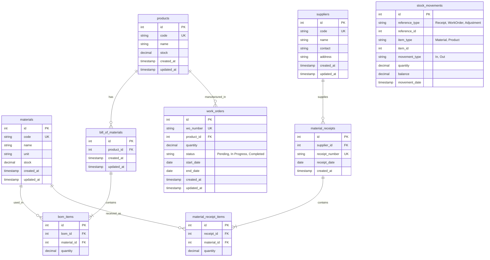

# Entity Relationship Diagram (ERD) - Mini Manufacturing System

Dokumen ini memuat arsitektur struktur tabel untuk Mini Manufacturing System (MMS) menggunakan representasi *Mermaid.js*.

## Mermaid Diagram

## Penjelasan Relasi (Relationships)

1. **Product & Bill of Materials (BOM):** Satu `Product` memiliki satu atau banyak definisi resep di dalam `bill_of_materials`.
2. **BOM & BOM Items:** `bill_of_materials` memuat rincian bahan melalui tabel `bom_items`, yang terhubung langsung ke tabel `materials`.
3. **Penerimaan (Receive Materials):** Entitas `suppliers` berelasi dengan histori penerimaan di tabel `material_receipts`. Detail dari barang yang diterima dicatat pada `material_receipt_items` yang merujuk pada `materials`.
4. **Produksi (Work Order):** Proses produksi (`work_orders`) mengacu pada entitas `products`.
5. **Stock Movement:** Tabel `stock_movements` menerapkan konsep *Polymorphic Relations* sederhana di mana kolom `item_type` dan `item_id` dapat merepresentasikan pergerakan pada `materials` atau `products`. Hal ini memudahkan pembuatan *Inventory Report* dalam satu tabel audit yang ditrigger secara otomatis.
